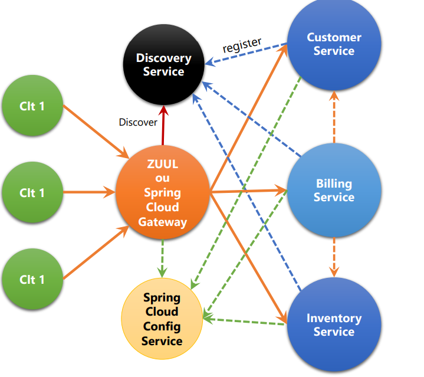

# 🎯 Objectif
Implémentation rapide de microservices sans respecter toutes les bonnes pratiques, dans le but de comprendre et d’explorer l’architecture microservices.
# Services :
- **Gateway service** : distribue les requêtes clients vers les services métier.
- **Discovery service** : enregistre les noms et adresses des microservices.
- **Configuration Service** : service dédié à la centralisation et à la distribution de la configuration des microservices.
- **config-repo** : dépôt Git centralisant les fichiers de configuration des microservices, avec gestion des versions.  
  - 👉 Lien du dépôt : https://github.com/HamzaRabih/config-ecommerce-microservice.git
- **Les services métier** : 
  - ***Inventory service*** : gestion des produits et du stock.
  - ***Customer service*** : gestion des clients.
  - ***Billing Service*** : gestion de la facturation.

# 📦 Dépendances utilisées :

- **Dépendances classiques** : Spring Data JPA, Spring Web, H2 Database, Lombok, …
- **Spring Data REST** : permet de démarrer facilement des services RESTful.
- **Config Client** : permet aux microservices de récupérer leur configuration depuis le Configuration Service (Spring Cloud Config).
- **Spring Boot Actuator** : monitoring et métriques des microservices.
- **Reactive Gateway** : nouvelle version de Spring Cloud Gateway utilisant les virtual threads.
- **Eureka Discovery Client** : permet aux microservices de s’enregistrer et de communiquer via Eureka.
- **Eureka Server** : serveur de découverte (Spring Cloud Netflix Eureka).
- **OpenFeign** : client HTTP déclaratif facilitant la communication entre microservices.
- **Resilience4j** : gestion de la tolérance aux pannes (circuit breaker, retry, rate limiter...).
- **Config serve**: centralise la configuration

## Architecture 



# Communication entre microservices

Il existe deux principales approches de communication entre microservices ; dans ce projet, nous utilisons la communication basée sur les Web Services.

#### 1-Synchrone :
- RMI (Remote Method Invocation)
- CORBA (Common Object Request Broker Architecture
- Web services : Open feign Frame-Work SOAP (http1.1 +XML) ,REST (Http1.1, JSON, XML, ..),GraphQL (Http1.1, JSON) ,GRPC (Http2, ProtoBuf)

#### 2- Asynchrone (Middlewares Orienté Message (MOM))
- Faire communiquer les systèmes distribués par l’intermédiaire d’un Broker (RabbitMQ, KAFKA, etc..)

# 📝 Notes techniques

- **@RepositoryRestResource** : expose automatiquement des endpoints REST sans créer de contrôleurs manuellement.
- **@Transient** : indique qu’un attribut d’une entité ne doit pas être persisté en base de données.
- **@EnableFeignClients** : active OpenFeign dans un microservice.
- **Framework déclaratif** : fournit des structures permettant de simplifier l’écriture de code (ex. : OpenFeign).
- **Framework programmatique** : propose des outils et conventions pour structurer le code tout en laissant un contrôle explicite (ex. : RestClient).
- **OpenFeign** : framework déclaratif simplifiant la communication inter-services.
- **RestClient** : framework programmatique facilitant les appels HTTP entre microservices.
-**@RefreshScope** : permet de recharger dynamiquement la configuration des microservices sans redémarrage, après une mise à jour des fichiers de configuration.
    - Endpoint de rafraîchissement : `POST http://localhost:8081/actuator/refresh`
    - Activation des endpoints Actuator :
      ```properties
      management.endpoints.web.exposure.include=*
      ```
